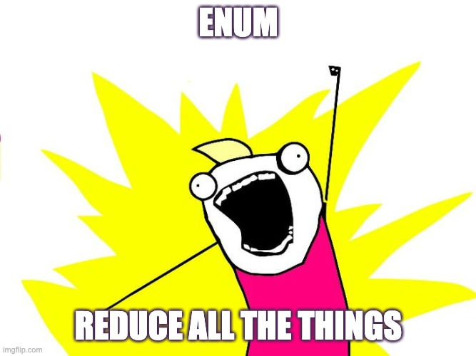

# [`Enum.reduce/3`](https://hexdocs.pm/elixir/1.13/Enum.html#reduce/3)

**Enum**.reduce(_enumerable_, _`acc`umulator_, _`fun`ction_)

- _`enumerable`_ is our list -> `["a", "a", "a", "b", "c", "c"]`
- _`acc`umulator_ is an empty map -> `%{}`
  - _`acc`_ will be returned to the function every time the function runs
  - _`acc`_ can be any enumerable [List, Map, Range, etc] and can be preloaded if desired
- _`fun`ction_ will be the action items from above

## Example Problem

```elixir
# starter list
["a", "a", "a", "b", "c", "c"]

# desired result
%{"a" => 3, "b" => 1, "c" => 2}
```

## Pseudo spec 🧠

- Take in a list
- Return a map
- Loop over each element in list
- Add letter key to map if it doesn't exist
- If letter exists, increment the its value

## Options?

- `Enum.map/2`
  - ❌ returns a list
  - `@spec map(t(), (element() -> any())) :: list()`
- `Enum.each`
  - ❌ returns an `:ok`
  - `@spec each(t(), (element() -> any())) :: :ok`
- `Enum.reduce`
  - ✅ returns a map
  - `@spec reduce(t(), acc(), (element(), acc() -> acc())) :: acc()`

```elixir
iex> my_list = ["a", "a", "a", "b", "c", "c", "a", "a", "b"]
#=> ["a", "a", "a", "b", "c", "c", "a", "a", "b"]

iex> Enum.reduce(my_list, %{}, fn char, map ->
  Map.update(map, char, 1, fn v -> v + 1 end)
end)
#=> %{"a" => 5, "b" => 2, "c" => 2}
```

## Results, step by step with verbosity

```elixir
acc1 = Map.update(%{}, "a", 1, fn v -> v + 1 end)
  #=> %{"a" => 1}
acc2 = Map.update(acc1, "a", 1, fn v -> v + 1 end)
  #=> %{"a" => 2}
acc3 = Map.update(acc2, "a", 1, fn v -> v + 1 end)
  #=> %{"a" => 3}
acc4 = Map.update(acc3, "b", 1, fn v -> v + 1 end)
  #=> %{"a" => 3, "b" => 1}
acc5 = Map.update(acc4, "c", 1, fn v -> v + 1 end)
  #=> %{"a" => 3, "b" => 1, "c" => 1}
acc6 = Map.update(acc5, "c", 1, fn v -> v + 1 end)
  #=> %{"a" => 3, "b" => 1, "c" => 2}
acc7 = Map.update(acc6, "a", 1, fn v -> v + 1 end)
  #=> %{"a" => 4, "b" => 1, "c" => 2}
acc8 = Map.update(acc7, "a", 1, fn v -> v + 1 end)
  #=> %{"a" => 5, "b" => 1, "c" => 2}
acc9 = Map.update(acc8, "b", 1, fn v -> v + 1 end)
  #=> %{"a" => 5, "b" => 2, "c" => 2}
```

## [`Enum.reduce/2`](https://hexdocs.pm/elixir/1.13/Enum.html#reduce/2)

Enum.reduce(enumerable, `fun`ction)

- tl;dr -> if you want to specify an accumulator, use `reduce/3` instead
- `reduce/2` differs from `reduce/3` in that the first element of the `enumerable` is used as the accumulator

## [`Enum.frequencies/1`](https://hexdocs.pm/elixir/1.13/Enum.html#frequencies/1)

Spoiler: this is a shortcut for our `Enum.reduce/3` example

```elixir
@spec frequencies(t) :: map
def frequencies(enumerable) do
  reduce(enumerable, %{}, fn key, acc ->
    case acc do
      %{^key => value} -> %{acc | key => value + 1}
      %{} -> Map.put(acc, key, 1)
    end
  end)
end
```

```elixir
iex> my_list = ["a", "a", "a", "b", "c", "c", "a", "a", "b"]
#=> ["a", "a", "a", "b", "c", "c", "a", "a", "b"]

iex> Enum.frequencies(my_list)
#=> %{"a" => 5, "b" => 2, "c" => 2}
```

## [Reduce...everywhere?!?](https://github.com/elixir-lang/elixir/blob/v1.13.4/lib/elixir/lib/enum.ex)



The following Enum functions use reduce under the hood 🔧 (53/112)

1. `all?`
1. `any?`
1. `chunk_while`
1. `count`
1. `count_until`
1. `dedup`
1. `dedup_by`
1. `drop`
1. `drop_every`
1. `drop_while`
1. `each`
1. `empty?`
1. `filter`
1. `filter_map`
1. `find`
1. `find_index`
1. `find_value`
1. `flat_map`
1. `flat_map_reduce`
1. `frequencies`
1. `frequencies_by`
1. `group_by`
1. `intersperse`
1. `into`
1. `join`
1. `map`
1. `map_every`
1. `map_intersperse`
1. `map_reduce`
1. `member?`
1. `min_max`
1. `min_max_by`
1. `split_with`
1. `reduce_while`
1. `reject`
1. `reverse`
1. `scan`
1. `shuffle`
1. `sort`
1. `split`
1. `split_while`
1. `sum`
1. `product`
1. `take`
1. `take_every`
1. `take_random`
1. `take_while`
1. `uniq_by`
1. `unzip`
1. `with_index`
1. `zip`
1. `zip_with`
1. `zip_reduce`

On top of that, tons of private helper functions within Enum use reduce as well
